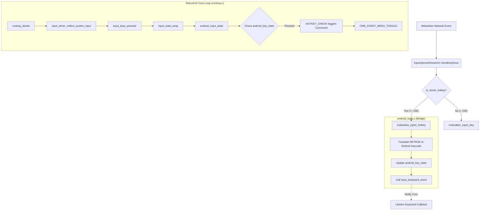

# RetroArch Android Hotkey Injection Fix

## Changes Made

### Input Driver Fix
Modified [android_input.c](file:///e:/MoboalienRetroArch/input/drivers/android_input.c) to ensure that `moboalien_inject_hotkey` updates the internal keyboard state bitmask.

Previously, `moboalien_inject_hotkey` only called `input_keyboard_event`, which is sufficient for cores to receive keyboard input via callbacks but is **not enough** for RetroArch's internal hotkey system (e.g., menu toggle). RetroArch's hotkey detection relies on polling the current input state via `input_state`, which on Android checks the `android_key_state` array.

```c
void moboalien_inject_hotkey(int retrok, int down)
{
   if (retrok > 0 && retrok < RETROK_LAST)
   {
      int keycode = rarch_keysym_lut[retrok];
      if (keycode > 0 && keycode < MAX_KEYS * 8)
      {
         if (down)
            BIT_SET(android_key_state[ANDROID_KEYBOARD_PORT], keycode);
         else
            BIT_CLEAR(android_key_state[ANDROID_KEYBOARD_PORT], keycode);
      }
   }
   input_keyboard_event(down, retrok, retrok, 0, RETRO_DEVICE_KEYBOARD);
}
```

## RetroArch Android Input Flow

The following flowchart illustrates how an injected key event travels through the system and eventually triggers a hotkey action like "Menu Toggle".



## Verification
- Verified that `rarch_keysym_lut` correctly maps `RETROK_F1` (282) to `AKEYCODE_F1` (131).
- Verified that `android_input_state` for `RETRO_DEVICE_KEYBOARD` checks the `ANDROID_KEYBOARD_PORT` index of `android_key_state`.
- Verified that `ANDROID_KEYBOARD_PORT` is correctly defined as `DEFAULT_MAX_PADS`.
